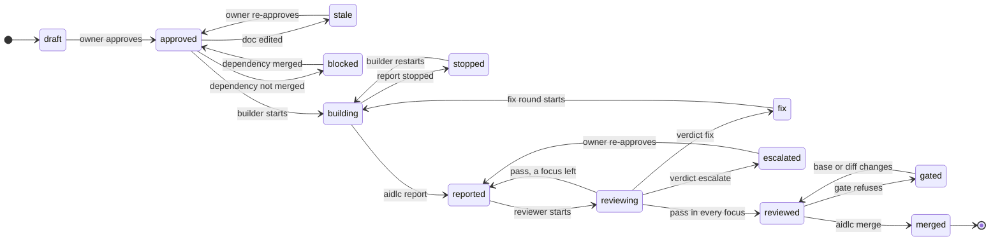

```mermaid
stateDiagram-v2
  direction LR
  [*] --> draft
  draft --> approved: owner approves
  approved --> stale: doc edited
  stale --> approved: owner re-approves
  approved --> blocked: dependency not merged
  blocked --> approved: dependency merged
  approved --> building: builder starts
  building --> stopped: report stopped
  stopped --> building: builder restarts
  building --> reported: aidlc report
  reported --> reviewing: reviewer starts
  reviewing --> reported: pass, a focus left
  reviewing --> fix: verdict fix
  fix --> building: fix round starts
  reviewing --> escalated: verdict escalate
  escalated --> reported: owner re-approves
  reviewing --> reviewed: pass in every focus
  reviewed --> gated: gate refuses
  gated --> reviewed: base or diff changes
  reviewed --> merged: aidlc merge
  merged --> [*]
```
