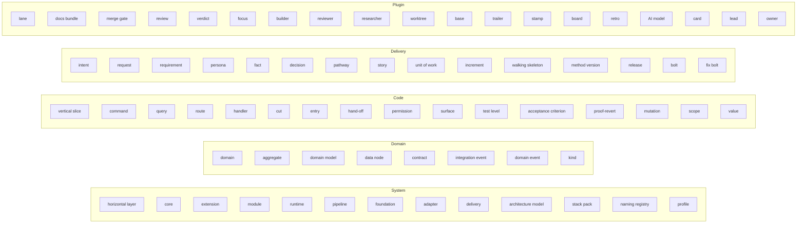

```mermaid
flowchart LR
  subgraph System["System"]
    System_horizontal_layer["horizontal layer"]
    System_core["core"]
    System_extension["extension"]
    System_module["module"]
    System_runtime["runtime"]
    System_pipeline["pipeline"]
    System_foundation["foundation"]
    System_adapter["adapter"]
    System_delivery["delivery"]
    System_architecture_model["architecture model"]
    System_stack_pack["stack pack"]
    System_naming_registry["naming registry"]
    System_profile["profile"]
  end
  subgraph Domain["Domain"]
    Domain_domain["domain"]
    Domain_aggregate["aggregate"]
    Domain_domain_model["domain model"]
    Domain_data_node["data node"]
    Domain_contract["contract"]
    Domain_integration_event["integration event"]
    Domain_domain_event["domain event"]
    Domain_kind["kind"]
  end
  subgraph Code["Code"]
    Code_vertical_slice["vertical slice"]
    Code_command["command"]
    Code_query["query"]
    Code_route["route"]
    Code_handler["handler"]
    Code_cut["cut"]
    Code_entry["entry"]
    Code_hand_off["hand-off"]
    Code_permission["permission"]
    Code_surface["surface"]
    Code_test_level["test level"]
    Code_acceptance_criterion["acceptance criterion"]
    Code_proof_revert["proof-revert"]
    Code_mutation["mutation"]
    Code_scope["scope"]
    Code_value["value"]
  end
  subgraph Delivery["Delivery"]
    Delivery_intent["intent"]
    Delivery_request["request"]
    Delivery_requirement["requirement"]
    Delivery_persona["persona"]
    Delivery_fact["fact"]
    Delivery_decision["decision"]
    Delivery_pathway["pathway"]
    Delivery_story["story"]
    Delivery_unit_of_work["unit of work"]
    Delivery_increment["increment"]
    Delivery_walking_skeleton["walking skeleton"]
    Delivery_method_version["method version"]
    Delivery_release["release"]
    Delivery_bolt["bolt"]
    Delivery_fix_bolt["fix bolt"]
  end
  subgraph Plugin["Plugin"]
    Plugin_lane["lane"]
    Plugin_docs_bundle["docs bundle"]
    Plugin_merge_gate["merge gate"]
    Plugin_review["review"]
    Plugin_verdict["verdict"]
    Plugin_focus["focus"]
    Plugin_builder["builder"]
    Plugin_reviewer["reviewer"]
    Plugin_researcher["researcher"]
    Plugin_worktree["worktree"]
    Plugin_base["base"]
    Plugin_trailer["trailer"]
    Plugin_stamp["stamp"]
    Plugin_board["board"]
    Plugin_retro["retro"]
    Plugin_AI_model["AI model"]
    Plugin_card["card"]
    Plugin_lead["lead"]
    Plugin_owner["owner"]
  end
```
