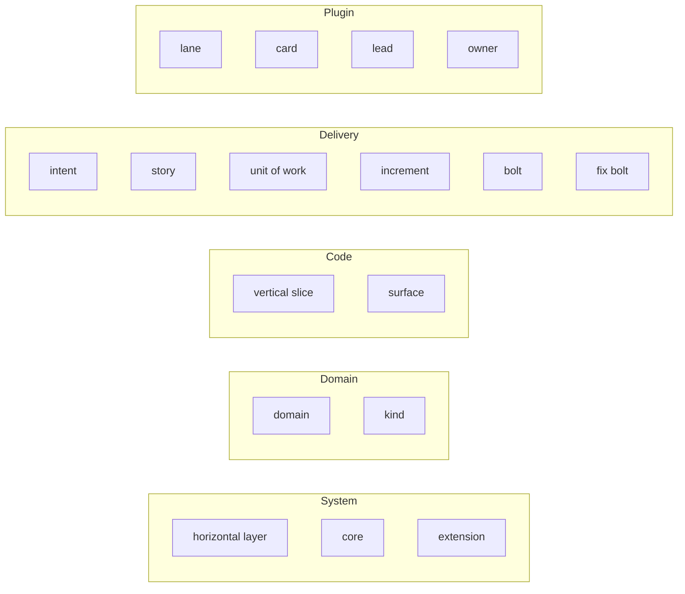

```mermaid
flowchart LR
  subgraph System["System"]
    System_horizontal_layer["horizontal layer"]
    System_core["core"]
    System_extension["extension"]
  end
  subgraph Domain["Domain"]
    Domain_domain["domain"]
    Domain_kind["kind"]
  end
  subgraph Code["Code"]
    Code_vertical_slice["vertical slice"]
    Code_surface["surface"]
  end
  subgraph Delivery["Delivery"]
    Delivery_intent["intent"]
    Delivery_story["story"]
    Delivery_unit_of_work["unit of work"]
    Delivery_increment["increment"]
    Delivery_bolt["bolt"]
    Delivery_fix_bolt["fix bolt"]
  end
  subgraph Plugin["Plugin"]
    Plugin_lane["lane"]
    Plugin_card["card"]
    Plugin_lead["lead"]
    Plugin_owner["owner"]
  end
```
