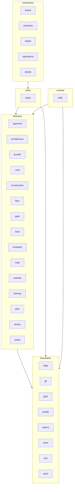

```mermaid
flowchart TB
  subgraph runtime
    runtime_aidlc[aidlc]
  end
  subgraph extensions
    extensions_board[board]
    extensions_contracts[contracts]
    extensions_intake[intake]
    extensions_operations[operations]
    extensions_stacks[stacks]
  end
  subgraph entry
    entry_index[index]
  end
  subgraph domains
    domains_approval[approval]
    domains_architecture[architecture]
    domains_bundle[bundle]
    domains_card[card]
    domains_construction[construction]
    domains_flow[flow]
    domains_gate[gate]
    domains_host[host]
    domains_inception[inception]
    domains_map[map]
    domains_method[method]
    domains_naming[naming]
    domains_plan[plan]
    domains_review[review]
    domains_setup[setup]
  end
  subgraph foundation
    foundation_data[data]
    foundation_git[git]
    foundation_glob[glob]
    foundation_profile[profile]
    foundation_seams[seams]
    foundation_store[store]
    foundation_text[text]
    foundation_yaml[yaml]
  end
  domains --> foundation
  entry --> domains
  entry --> foundation
  extensions --> entry
  runtime --> domains
  runtime --> foundation
```
