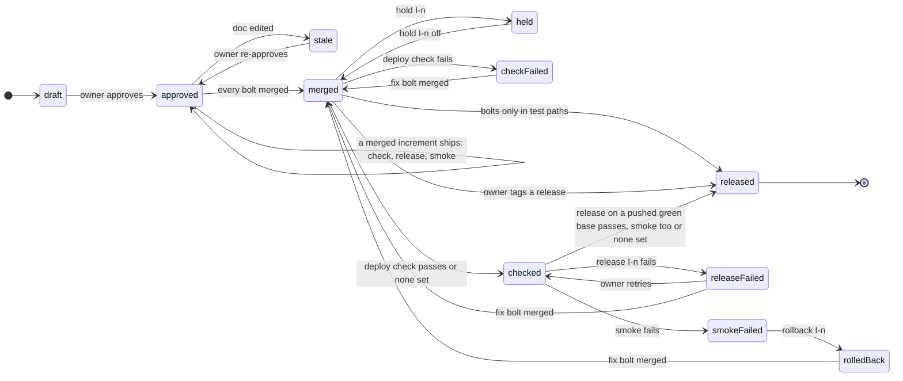

```mermaid
stateDiagram-v2
  direction LR
  [*] --> draft
  draft --> approved: owner approves
  approved --> stale: doc edited
  stale --> approved: owner re-approves
  approved --> approved: a merged increment ships: check, release, smoke
  approved --> merged: every bolt merged
  merged --> released: bolts only in test paths
  merged --> released: owner tags a release
  merged --> held: hold I-n
  held --> merged: hold I-n off
  merged --> checkFailed: deploy check fails
  checkFailed --> merged: fix bolt merged
  merged --> checked: deploy check passes or none set
  checked --> releaseFailed: release I-n fails
  releaseFailed --> checked: owner retries
  releaseFailed --> merged: fix bolt merged
  checked --> smokeFailed: smoke fails
  smokeFailed --> rolledBack: rollback I-n
  rolledBack --> merged: fix bolt merged
  checked --> released: release on a pushed green base passes, smoke too or none set
  released --> [*]
```
