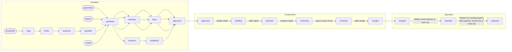

```mermaid
flowchart LR
  subgraph Inception
    greenfield([greenfield]) --> questions --> domains --> facts --> approved
    feature([feature]) --> questions --> domains --> facts --> approved
    brownfield([brownfield]) --> map --> kinds --> business --> baseline --> questions --> domains --> facts --> approved
    model([model]) --> questions --> research --> modelDoc --> approved
  end
  subgraph Construction
    b_approved[approved] -->|builder starts| b_building[building]
    b_building[building] -->|aidlc report| b_reported[reported]
    b_reported[reported] -->|reviewer starts| b_reviewing[reviewing]
    b_reviewing[reviewing] -->|pass in every focus| b_reviewed[reviewed]
    b_reviewed[reviewed] -->|aidlc merge| b_merged[merged]
  end
  subgraph Operation
    i_merged[merged] -->|deploy check passes or none set| i_checked[checked]
    i_checked[checked] -->|release on a pushed green base passes, smoke too or none set| i_released[released]
  end
  approved --> b_approved
  b_merged --> i_merged
```
